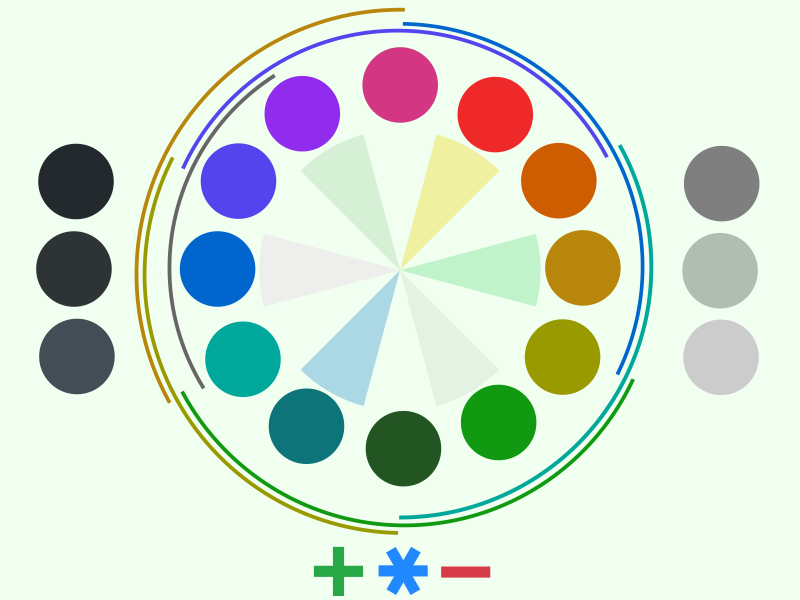

# Light green color theme for Neovim

This color scheme is a port of Emacs [organic-green](https://github.com/kostafey/organic-green-theme) for Neovim.

<p align="center">
  
  
</p>

Created with [colorgen-nvim](https://github.com/ChristianChiarulli/colorgen-nvim)

## Update

```bash
colorgen-nvim organicgreen.toml && \
    rm -rf colors && \
    rm -rf lua/organicgreen && \
    mv organicgreen/colors . && \
    mv organicgreen/lua/organicgreen lua && \
    rm -r organicgreen
```
